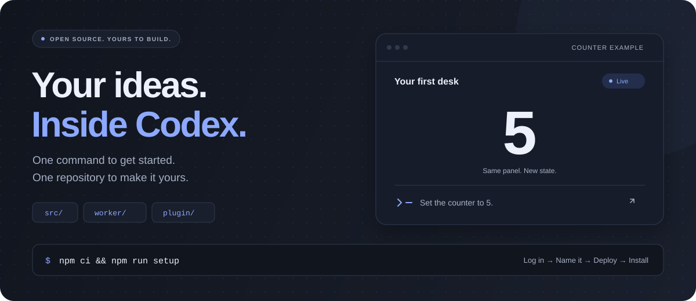

<p align="center"></p>

<h1 align="center">CoDesk</h1>

<p align="center"><strong>Your personal AI desk right inside Codex Desktop.</strong></p>

<p align="center"></p>

Build your own interactive Codex plugin. CoDesk brings a React frontend, a live backend, and your assistant’s instructions together in one editable repository. Start with the counter example, then make it your own.

<p align="center">React + Vite · Tailwind CSS · Cloudflare Workers · MCP Apps · <a href="LICENSE">MIT licensed</a></p>

## Get started

You’ll need **Node.js 24+**, **Codex Desktop**, and a **Cloudflare account**.

Clone or fork [nikdelvin/codesk](https://github.com/nikdelvin/codesk), open a terminal in the repository, and run:

```sh
npm ci && npm run setup
```

Setup guides you through **Cloudflare login → naming your plugin → deployment → plugin installation**. It discovers your Cloudflare subdomain and checks the live app for you. Login and naming require your input; no connection files to copy by hand.

When it finishes, fully quit and reopen Codex, start a new task, and ask **“Open My Desk”** using the name you chose. The example updates in the same panel and supports fullscreen.

Your UI, your tools, your cloud. Everything you need to change lives in this repository.

---

## Developer details

<details>
<summary><strong>Editing, commands, architecture, and other hosting options</strong></summary>

### Make it yours

| What to change | Where to edit |
| --- | --- |
| Panel UI and styling | `src/App.tsx`, `src/index.css` |
| Homepage and branding | `src/components/`, `src/assets/codesk.svg` |
| Application state schema | `src/example.ts` |
| MCP tools and application behavior | `worker/mcp/server.ts`, `worker/example.ts` |
| Assistant instructions | `plugin/skills/open-plugin/SKILL.md` |
| Plugin name and public URL | `app.config.json`, written by setup |

The host bridge and WebSocket hook live in `src/plugin/`; shared protocol envelopes live in `src/contracts/`. `worker/realtime.ts` handles connections independently of the example’s value schema. Keep server imports outside the browser dependency graph.

When replacing the example, update its tool inputs, storage, retry comparison, and tests together. Changing the UI alone does not replace its numeric behavior. Bump the schema version when saved records become incompatible.

### Everyday commands

| Command | What it does |
| --- | --- |
| `npm run dev` | Start local Vite development |
| `npm run preview` | Build and preview the production Worker |
| `npm run test:install` | Install Chromium for browser tests; run once |
| `npm run verify` | Run lint, TypeScript, build, and all tests |
| `npm run deploy:dry-run` | Validate the deployment bundle without publishing |
| `npm run deploy` | Build, deploy, and check the live app |
| `npm run plugin:install` | Install or refresh the local Codex plugin |

Setup runs deployment smoke checks. Run `test:install` and `verify` separately for the full suite. `npm run verify:example` optionally exercises the live counter; `npm run verify:deployed` checks the deployed app against the local build. More individual steps are listed in `package.json`.

### Setup and installation notes

- `npm ci` installs local Wrangler and Codex CLIs. No global CLI installation is needed.
- Choose a new plugin/Worker name for a new deployment. Reusing a Worker name in the same account updates that Worker. `npm run configure -- --plugin-name my-desk` configures a name directly; `--account <account-id>` selects an account and `--name <worker-name>` overrides the Worker name.
- Configuration reads your actual `workers.dev` subdomain. If your account has none, create one in Cloudflare when prompted and rerun configure. Custom domains need separate Cloudflare configuration; the setup scripts currently use `workers.dev`.
- `wrangler.json` holds the Worker name, account, and bindings. `app.config.json` holds the plugin identity and origin. Run configure for your own account before deployment; credentials stay in Wrangler’s login storage.
- Plugin installation uses your current Codex profile (`CODEX_HOME` when set). Keep the checkout: the generated local marketplace lives in ignored `.plugin-build/`. Use `npm run plugin:build` to inspect it without installing.
- If the skill appears without its MCP tools, check `npm run plugin:list`, fully quit and reopen Codex, then start a new task. The desktop app must be signed in; `npm run codex:login` is available for CLI login.

### How it works

One Cloudflare Worker serves the React assets, MCP at `/mcp`, and WebSockets at `/ws/{runId}`. Unknown paths return 404. HTML is uncached, static assets are hashed, and MCP resource IDs follow the packaged HTML checksum. Already-open panels keep their loaded code.

The `CODESK_DO` binding points to the stable `CoDesk` Durable Object class. It coordinates tool calls and live sockets for each session. `worker/codesk.ts` selects the example application; `worker/realtime.ts` provides the reusable relay. Snapshot delivery and mutations share a lock so a new subscriber cannot miss an update. The browser validates frames, orders revisions, and recovers through reconnect snapshots.

`exports.CoDesk` in `wrangler.json` provisions SQLite storage during deployment. Keep that declaration for later deployments. Renaming an existing deployed class requires an explicit namespace rename; changing the source name alone does not transfer storage. [Cloudflare class exports](https://developers.cloudflare.com/durable-objects/reference/durable-objects-migrations/)

The example tools are `open_plugin`, `set_state`, and `get_state`. Values range from **−999 to 999**. Use a fresh `operation_id` for each change; identical retries return the original receipt. Displayed state comes only from WebSockets, with private capabilities and the `codesk.ws` subprotocol.

Sessions last **one hour**, with up to **256 mutations** and **four subscribers**. The latest value and receipts survive panel closure and hibernation until expiration. D1 can hold longer-lived application data; the relay still coordinates live connections. This example has no authentication.

Browser preview shows the landing page and an unconnected example. Tests use a host fixture for live updates; after deployment, also check **0 → 5 → 12 → 3** and fullscreen in one native Codex panel.

### Other hosting options

Use the included prompts to plan a migration with your coding agent:

- [Vercel](migration-prompts/vercel.md)
- [Firebase + Google Cloud](migration-prompts/firebase-google-cloud.md)
- [Self-hosted](migration-prompts/self-hosted.md)

For example: **“Read migration-prompts/vercel.md and plan the migration for this checkout.”** These are planning prompts, not implemented adapters. Review storage, realtime delivery, data migration, and costs before deploying a replacement. Keep the [MIT license](LICENSE) when sharing your version.

</details>
